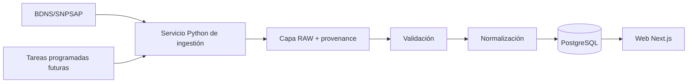
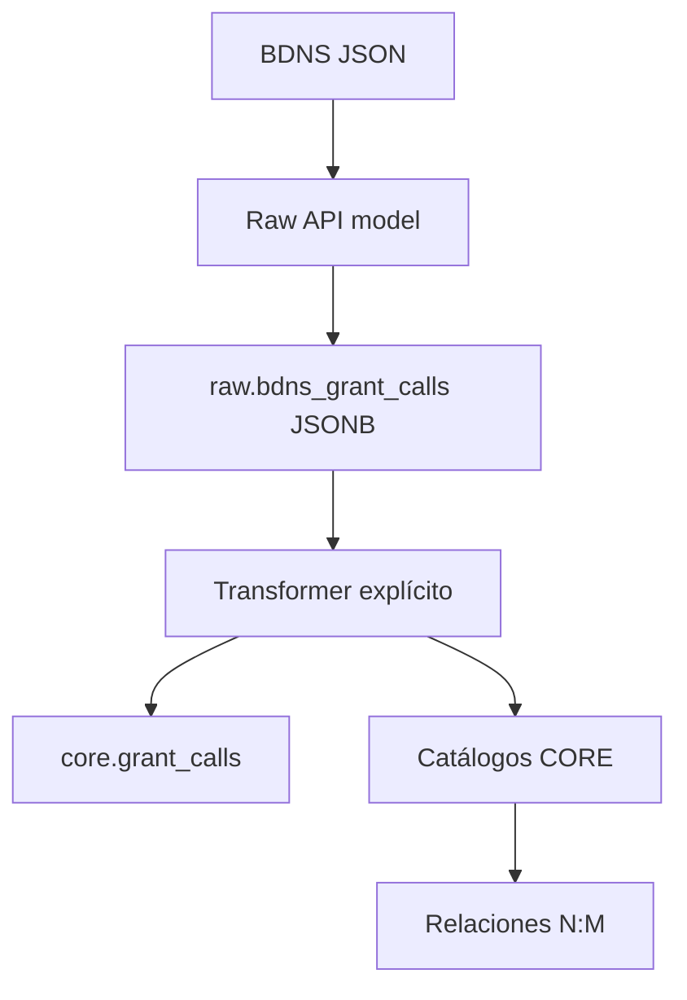

# Arquitectura inicial

La BDNS/SNPSAP es la fuente primaria inicial. El servicio Python captura lotes incrementales, conserva la respuesta RAW y metadatos de procedencia, valida los campos y produce entidades normalizadas para PostgreSQL. La web futura en Next.js + TypeScript consultará PostgreSQL mediante una API propia futura.

## Data Core V0.1 implementado

`raw.bdns_grant_calls` conserva el payload recibido, hash SHA-256 canónico, endpoint, primera/última observación y timestamps. `core.grant_calls` enlaza mediante `raw_id` con RAW y contiene el modelo normalizado. Los catálogos observados se almacenan en `core.organizations`, `core.sectors`, `core.regions`, `core.beneficiary_types` y `core.funds`.

El ETL no consulta PostgreSQL desde el cliente HTTP: separa HTTP → modelo RAW → persistencia RAW → transformación → persistencia CORE. Cada convocatoria se persiste en una transacción independiente.

La estrategia incremental inicial seguirá la guía oficial: consultar por ventanas de `fechaDesde`/`fechaHasta` usando el formato documentado `DD/MM/YYYY`, obtener primero los códigos BDNS y después el detalle, y revalidar ventanas recientes semanal, mensual y anualmente. El cliente debe respetar 10 GET por IP/segundo, no usar concurrencia agresiva y aplicar pausas entre llamadas. La semántica exacta de inclusión de fechas queda pendiente de verificación.

Las consultas de usuarios **no deberán depender directamente de la API de BDNS**: Opportunity Intel mantendrá su propia capa de datos para consistencia, rendimiento, histórico, auditoría y enriquecimiento controlado.

## Separación de datos

- **Oficiales:** valores recibidos de la fuente, con referencia y timestamp.
- **Derivados/normalizados:** transformaciones propias, siempre etiquetadas.
- **Privados de usuario (futuro):** aislados del dominio oficial, minimizados y sujetos a privacidad.

Alembic es la fuente de verdad del esquema; no se crean tablas automáticamente en runtime. Para desarrollo existe un único servicio PostgreSQL en `compose.yaml`, expuesto sólo en `127.0.0.1:55432`, con volumen dedicado y healthcheck. No se implementan aún API web, tareas programadas reales, usuarios, concesiones ni documentos persistentes.
