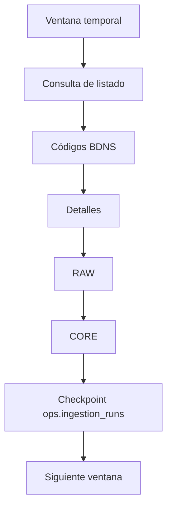

# Estrategia de backfill histórico

Este documento define una carga histórica reproducible para BDNS/SNPSAP. No autoriza un backfill completo en el entorno de desarrollo.

## Ventanas y ritmo

La densidad debe medirse primero. Para periodos recientes conviene empezar por días o semanas; para periodos antiguos con menor densidad pueden usarse meses. Una ventana debe producir un lote manejable y repetible, no maximizar el número de páginas por ejecución.

Cada página de listado produce códigos BDNS y cada código se resuelve mediante su detalle. El cliente conserva una pausa configurable, respeta los límites documentados por la fuente, evita concurrencia agresiva y aplica retries con backoff sólo para timeouts, errores de red, `429` y errores `5xx`.

## Reanudación y checkpoints

Para cargas de cientos de miles la reanudación segura necesita estado persistente. La migración `20260819_0002_ingestion_runs` crea `ops.ingestion_runs` con ventana, estado, tiempos, contadores, última página y resumen de errores. El motor `backfill_calls.py` ya crea/reutiliza el run, actualiza `last_page` después de cada página confirmada y marca `completed`, `failed` o `interrupted`. El estado operacional permanece separado de `core`.

La unidad de reanudación es una ventana más su página de listado. `last_page` significa la última página completamente confirmada, no la última iniciada. Si una ejecución se interrumpe antes del checkpoint, se repite esa página; los códigos se pueden repetir sin duplicar datos. Las ventanas completadas se omiten con `--resume`.

## Idempotencia y fallos

`bdns_code` identifica la convocatoria y el hash del payload RAW distingue sin cambios de cambios reales. RAW y CORE se escriben en una transacción por convocatoria. Los códigos que fallen deben conservarse en el resumen o en una cola de retry posterior, sin marcar la ventana como completamente correcta.

Los fallos de detalle se clasifican por código y causa en `ops.ingestion_failures`; se conserva el histórico y se impide duplicar el mismo fallo activo. `--retry-failed` permite volver a intentarlos y marca `resolved_at` al resolverlos. Los reintentos son acotados y no bloquean ventanas independientes.

## Estado de implementación

### IMPLEMENTED

- Ventanas daily, weekly y monthly inclusivas, contiguas y deterministas.
- Streaming por página con tamaño por defecto 100 y máximo operativo 500.
- Transacción RAW + CORE por convocatoria.
- Checkpoint por última página confirmada.
- `--resume`, `--max-windows`, `--limit-per-window`, `--retry-failed` y `--dry-run`.
- Advisory lock PostgreSQL por ventana.
- Logging compacto por ventana/página y errores sanitizados.
- Inspección read-only de runs y fallos.

### PLANNED

- Reanudación distribuida entre workers, que no se necesita para el modo secuencial actual.
- Política de backfill histórico masivo y retención de logs.
- Revalidación programada diaria/semanal/mensual.

## Actualización continua

- Reciente: revalidación diaria de una ventana corta.
- Intermedio: revalidación semanal de ventanas recientes.
- Antiguo: revalidación mensual o anual según estabilidad y documentación oficial.

La semántica exacta de inclusión de fechas y cualquier endpoint adicional siguen sujetos a `TODO: verificar contra documentación oficial` antes de automatizar una campaña histórica completa.

## Coste operativo orientativo

La carga actual hace aproximadamente una llamada de listado por página y una llamada de detalle por código. Con el ritmo conservador observado, el cuello de botella es la red y el límite de llamadas, no la transformación local. Para 1.000, 10.000, 100.000 y 600.000 convocatorias, el número de detalles es del mismo orden y el tiempo crecerá aproximadamente de forma lineal si no se paraleliza; la paralelización no debe introducirse sin una política explícita de rate limiting. RAW JSONB, índices y relaciones crecerán además con el tamaño y la variabilidad de los payloads.
